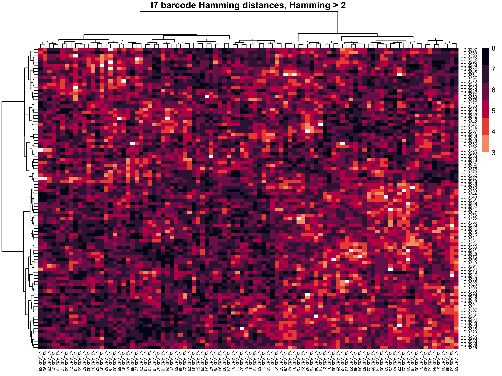
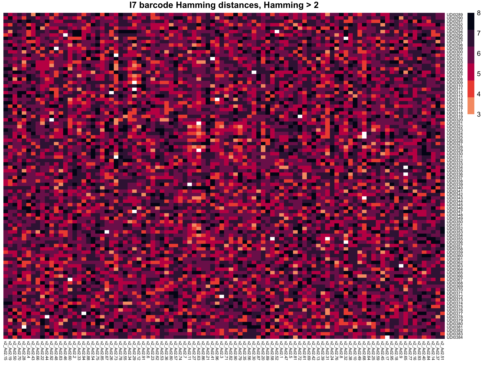
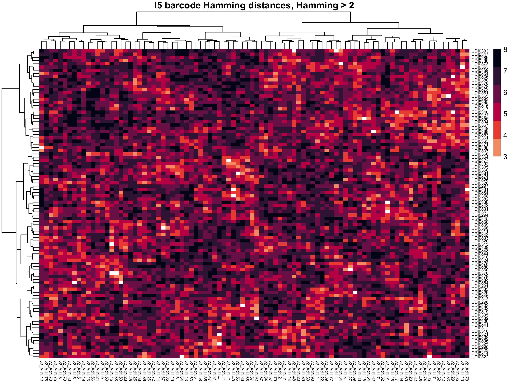
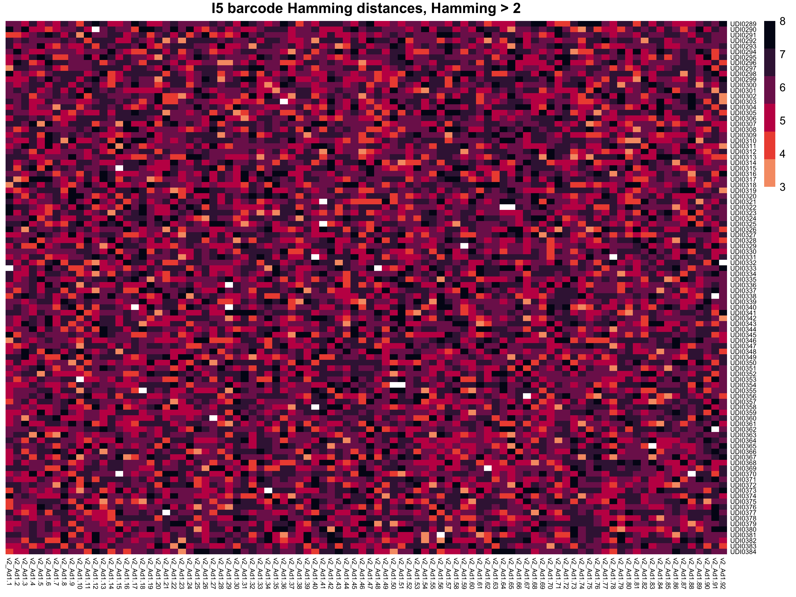

This repository houses information and analyses of Troutman lab sequencing barcodes. Full length unique dual index adapters, set 4 (289:384) were purchased from Perkin Elmer. We also have small aliquots of set 1 and 2 shared from the labs' of Chris Glass and Sven Heinz at UC San Diego. Nextera barcoding PCR primers were ordered from IDT and sourced from a Howard Chang and William Greenleaf publication in Nature. The data is in **[Supplementary Table 1](https://static-content.springer.com/esm/art%3A10.1038%2Fnature14590/MediaObjects/41586_2015_BFnature14590_MOESM36_ESM.xlsx)**.  
[Buenrostro JD, Wu B, Litzenburger UM, Ruff D, Gonzales ML, Snyder MP, Chang HY, Greenleaf WJ. Single-cell chromatin accessibility reveals principles of regulatory variation. Nature. 2015 Jul 23;523(7561):486-90. doi: 10.1038/nature14590. Epub 2015 Jun 17. PMID: 26083756; PMCID: PMC4685948.](https://pubmed.ncbi.nlm.nih.gov/26083756/)  

### Hamming distance comparison of NextFlex Set 4 and Nextera I7 indices.

### Hamming distance comparison of NextFlex Set 4 and Nextera I5 indices.

