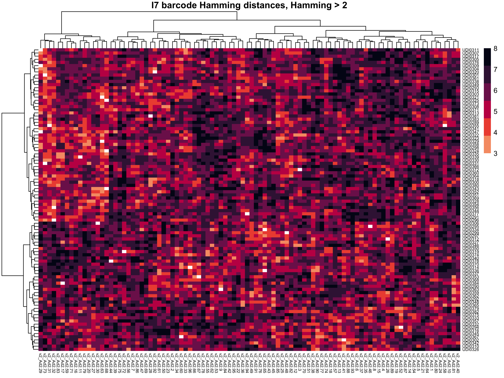

This repository houses information and analyses of Troutman lab sequencing barcodes. Full length unique dual index adapters, set 4 (289:384) were purchased from Perkin Elmer. We also have small aliquots of set 1 and 2 shared from the labs' of Chris Glass and Sven Heinz at UC San Diego. Nextera barcoding PCR primers were ordered from IDT and sourced from a Howard Chang and William Greenleaf publication in Nature. The data is in **[Supplementary Table 1](https://static-content.springer.com/esm/art%3A10.1038%2Fnature14590/MediaObjects/41586_2015_BFnature14590_MOESM36_ESM.xlsx)**.  
[Buenrostro JD, Wu B, Litzenburger UM, Ruff D, Gonzales ML, Snyder MP, Chang HY, Greenleaf WJ. Single-cell chromatin accessibility reveals principles of regulatory variation. Nature. 2015 Jul 23;523(7561):486-90. doi: 10.1038/nature14590. Epub 2015 Jun 17. PMID: 26083756; PMCID: PMC4685948.](https://pubmed.ncbi.nlm.nih.gov/26083756/)  

```{r, include=FALSE}
library(tidyverse)
```

Below is a list of barcode collisions between Nextera primers and  NEXTFLEX Unique Dual Index Barcodes (Set D, adapters 289-384). Barcode pairs listed below should not be included on the same sequencing lane.

# i7 barcode collisions
Barcode collisions are ordered by the NEXTFLEX id at left, or the Nextera id at right.
```{r, comment=FALSE, warning=FALSE, echo=FALSE, error=FALSE, message=FALSE}
i7 <- read_csv("indexDistances/i7_distances.csv", show_col_types = F) %>% 
  filter(hamming < 3) %>% select(-seqlev) %>%
  separate(col = Nextera_i7, into = c("tmp1", "tmp2"), sep = "\\.") %>%
  mutate(tmp2 = str_pad(tmp2, width = 3, side = "left", pad = "0")) %>%
  unite(col = Nextera_i7, tmp1:tmp2, sep = ".")

bind_cols(i7 %>% arrange(NEXTFLEX_ID),
          i7 %>% arrange(Nextera_i7)) %>% mutate(empty = "") %>% relocate(empty, .after = 3) %>%
  knitr::kable(
    col.names = c(
      "NEXTFLEX_ID",
      "Nextera_i7",
      "Hamming Distance",
      "",
      "NEXTFLEX_ID",
      "Nextera_i7",
      "Hamming Distance"
    ),
    caption = str_c(
      tally(i7),
      "i7 barcode pairs fail to meet a minimal Hamming distance of greater than 2.",
      sep = " "
    )
  )
```

# i5 barcode collisions
Barcode collisions are ordered by the NEXTFLEX id at left, or the Nextera id at right.
```{r, comment=FALSE, warning=FALSE, echo=FALSE, error=FALSE, message=FALSE}
i5 <- read_csv("indexDistances/i5_distances.csv", show_col_types = F) %>% 
  filter(hamming < 3) %>% select(-seqlev) %>%
  separate(col = Nextera_i5, into = c("tmp1", "tmp2"), sep = "\\.") %>%
  mutate(tmp2 = str_pad(tmp2, width = 3, side = "left", pad = "0")) %>%
  unite(col = Nextera_i5, tmp1:tmp2, sep = ".")

bind_cols(i5 %>% arrange(NEXTFLEX_ID),
          i5 %>% arrange(Nextera_i5)) %>% mutate(empty = "") %>% relocate(empty, .after = 3) %>%
  knitr::kable(
    col.names = c(
      "NEXTFLEX_ID",
      "Nextera_i5",
      "Hamming Distance",
      "",
      "NEXTFLEX_ID",
      "Nextera_i5",
      "Hamming Distance"
    ),
    caption = str_c(
      tally(i5),
      "i5 barcode pairs fail to meet a minimal Hamming distance of greater than 2.",
      sep = " "
    )
  )
```


### Hamming distance comparison of NextFlex Set 4 and Nextera I7 indices.
Hamming distances and sequence Levenshtein distances were calculated separately for the pools of i5 or i7 barcode sequences. Analysis was performed using the [DNABarcodes](https://bioconductor.org/packages/release/bioc/vignettes/DNABarcodes/inst/doc/DNABarcodes.html) package authored by [Tilo Buschman and Leonid V. Bystrykh](https://pubmed.ncbi.nlm.nih.gov/24021088/).

The analysis script can be found [here](code/hammingDistanceCalculation.Rmd).




### Hamming distance comparison of NextFlex Set 4 and Nextera I5 indices.


